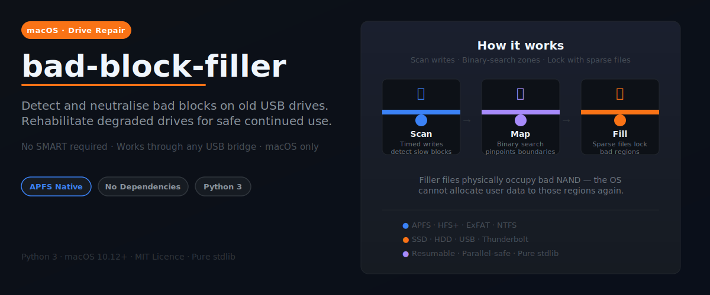

# bad-block-filler



A macOS command-line tool that **detects bad blocks on USB-connected drives**
(external HDDs and SSDs) and **permanently locks them** so the OS cannot write
user data there.  Drives that have become slow or unreliable can often continue
to be used safely for non-critical storage after treatment.

No third-party dependencies — pure Python 3 stdlib.

---

## Why this tool exists

Old USB drives — external HDDs left running for years, SSDs worn out by
torrenting or media work — develop **bad blocks**: regions of NAND or magnetic
media that respond very slowly or not at all.  macOS gives you no built-in way
to deal with this:

- **SMART diagnostics are blocked** by USB bridge chips.  `diskutil info`
  reports “Not Supported” and smartmontools cannot penetrate most USB
  enclosures.
- **`badblocks` is a Linux utility** unavailable on macOS.
- **Reformatting does not help** — the filesystem has no way to exclude
  specific physical regions.
- **Throwing the drive away** wastes a device that still works for 80–90% of
  its surface.

**bad-block-filler** solves this by measuring actual write latency — no SMART
required.  It locates slow regions with 1 MiB precision using binary search,
then places APFS sparse filler files over them.  The OS can no longer allocate
user data to those physical blocks.  The drive can go back into service for
archive storage, secondary backups, media libraries, or any non-critical role.

> **Ideal for:** external HDDs or SSDs connected via USB or Thunderbolt that
> have developed bad blocks from heavy use — torrenting, video editing,
> media ingestion, or simply old age.

> **Not a substitute for backup.** Filler files reduce the chance of new data
> landing on bad blocks; they do not repair the underlying hardware.  Always
> back up valuable data before running this tool.

---

## How it works

### Detection

1. A scan file is created that claims **all free space** on the target volume
   using `F_PREALLOCATE`, which forces the filesystem to reserve physical blocks
   up-front rather than lazily.

2. The file is written sequentially in **1 MiB blocks** (matching the SSD’s NAND
   erase-block granularity, or a larger auto-selected size for HDDs).
   After each block, `F_FULLFSYNC` flushes data all the way to physical media,
   bypassing the drive’s write-back cache.  Total time per block is measured.

3. If a block takes longer than `--slow-threshold` seconds (default 1.0 s):
   - the start of a bad region is recorded
   - the scanner **skips 1 GiB forward** to jump over the presumably bad area

4. When the scanner finds a fast block after a slow region:
   - a **binary search** between the last known slow block and the first fast
     block locates the exact MiB-precision boundary of the bad region
   - each search probe prints `[lo … hi]` so you can follow the narrowing

5. A visual ASCII bad-block map is printed at the end.

### Drive-type auto-detection

The tool queries `diskutil info` to determine whether the drive is an SSD or HDD:

- **SSD detected** → block size stays at 1 MiB (maximum precision)
- **HDD detected** → block size is auto-set to 16 MiB to amortise seek overhead
  and avoid false positives from filesystem fragmentation (see *HDD caveats*)
- **Unknown (USB bridge without SMART)** → stays at 1 MiB conservatively

Override at any time with `--block-mib`.

### Filler creation (APFS / HFS+)

**APFS (best):** uses APFS copy-on-write semantics:

1. `clonefile(scan_file, filler00000N)` — instant COW clone that shares all
   physical extents with the scan file; no data is copied.
2. `F_PUNCHHOLE` on the clone for every region *outside* the bad zone —
   APFS removes the clone’s reference to those extents without affecting the
   scan file.  The clone now physically occupies only the bad region’s NAND.
3. The scan file is deleted.  Good-region extents lose their last reference
   and are freed; bad-region extents remain held by filler clones. ✓

Result: `filler000001`, `filler000002` … each physically occupy exactly one
bad region, preventing the OS from placing user data there.

**HFS+:** `clonefile` is unavailable.  A single sparse filler is created by
punching holes in the scan file for all good regions.

**ExFAT / NTFS:** sparse files are not supported.  Detection produces a
`map.json` only.  After scanning you are asked whether to **Keep** the scan
file as a crude filler (bad blocks blocked, good blocks also occupied) or
**Delete** it (free space restored, no protection).

### map.json

`VOLUME_ROOT/.badblocks/map.json` records every bad region with byte offsets,
GiB coordinates, region size, and which filler file covers it.

### --force-remapping

Physical block placement changes after manual data migration or a third-party
defrag (HFS+).  `--force-remapping` deletes all existing filler files and runs
a fresh scan.

---

## Permissions

The tool requires **write access** to the target volume.  If it fails with a
permission error, the most common fix on macOS is:

> **System Settings → Privacy & Security → Full Disk Access**
> Add your terminal app, then quit and relaunch it.

If the volume has restrictive file permissions (e.g. formatted under a different
user), prepend `sudo`:

```sh
sudo python3 bad_block_filler.py /Volumes/MyDrive
```

---

## Quick start

```sh
# 1. API self-check (writes a 16 MiB test file, removes it — ~5 s)
python3 bad_block_filler.py /Volumes/MyDrive --api-check

# 2. Full scan + create fillers
python3 bad_block_filler.py /Volumes/MyDrive

# 3. Resume an interrupted scan (run the same command again)
python3 bad_block_filler.py /Volumes/MyDrive

# 4. Scan only, no fillers (diagnostic, drive left unchanged)
python3 bad_block_filler.py /Volumes/MyDrive --no-fillers

# 5. Re-scan after defragmentation
python3 bad_block_filler.py /Volumes/MyDrive --force-remapping

# 6. Remove all tool files from the volume (restore to original state)
python3 bad_block_filler.py /Volumes/MyDrive --clean
```

### Typical scan times

| Drive | Free space | Expected time |
|---|---|---|
| NVMe SSD (internal) | 200 GiB | ~2 min |
| USB SSD (healthy) | 200 GiB | ~20 min |
| USB SSD (degraded) | 200 GiB | 1–6 h |
| HDD (external, 5400 rpm) | 500 GiB | 1–2 h |

### Interrupt safety and resumption

Scans save progress automatically after each bad region is found (and every
~1 GiB of scanning).  If the scan is interrupted — Ctrl-C, crash, or a
deadlocked block that required a `diskutil unmount force` — just re-run the
same command.  The tool detects the leftover scan file, reads the saved
progress from it, and continues from where it left off:

```
  ↻  Resuming interrupted scan:
     Scan file : 953.2 GiB
     Scanned   : 145.76 GiB so far
     Found     : 138 bad region(s)
```

To discard the interrupted scan and start fresh:

```sh
sudo rm /Volumes/MyDrive/._bbf_scan_temp
```

---

## All options

| Flag | Default | Description |
|---|---|---|
| `volume` | (required) | Mount point of the target volume |
| `--force-remapping` | off | Delete existing fillers before scanning |
| `--slow-threshold SECS` | `1.0` | Seconds/block to consider slow (see table below) |
| `--block-mib MiB` | auto | Write-block size; auto = 1 for SSD, 16 for HDD |
| `--skip-gib GiB` | `1` | GiB to skip forward when a slow block is found |
| `--headroom-mib MiB` | `512` | Free space to keep for macOS bookkeeping |
| `--no-fillers` | off | Scan and report only; do not create filler files |
| `--clean` | off | Remove all tool files from the volume and exit |
| `--api-check` | off | Verify all macOS APIs on the volume and exit |

### Recommended threshold values

| Drive type | `--slow-threshold` | Meaning |
|---|---|---|
| NVMe SSD (internal) | `0.05` | 50 ms = <20 MiB/s |
| USB SSD (healthy) | `0.1` | 100 ms = <10 MiB/s |
| USB SSD (degraded) | `1.0` | 1 s = <1 MiB/s ← **default** |
| HDD external (5400 rpm) | `2.0` with `--block-mib 16` | see HDD caveats |
| HDD internal (7200 rpm) | `1.0` with `--block-mib 8` | see HDD caveats |

---

## Sample output

```
  Volume      : /Volumes/MyDrive
  Drive       : SSD (USB)
  Filesystem  : APFS — full filler support (COW clone + sparse holes)
  Free space  : 129.0 GiB
  Block size  : 1 MiB (auto: ssd)
  Scan file   : 128.5 GiB  (131,584 blocks × 1 MiB)
  Threshold   : 1.000 s / 1 MiB  (<1 MiB/s = bad)
  Skip on slow: 1 GiB forward

▶  Pre-allocating 128.5 GiB scan file … ✓  (128.5 GiB, lazy allocation)

▶  Scan  (128.5 GiB  |  1 MiB blocks  |  1 GiB skip on slow)
   Slow threshold: 1.000 s  (<1 MiB/s per block)

   [░] @0.0010 GiB      8 ms    128 MiB/s   0.0%  (1/131584)
   ...
   [█] @42.3945 GiB  2.80 s      0 MiB/s  SLOW ⚠  → skip to 43.39 GiB

   [░] @43.3945 GiB  fast — pinpointing bad-region boundary (binary search) …

   ↳ Binary search for boundary  [slow-side 42.3945 GiB … fast-side 43.3945 GiB]
   ↳   probe @42.8945 GiB       5 ms    190 MiB/s  fast     hi→42.8945  [42.3945 … 42.8945]
   ↳   probe @42.6445 GiB    2409 ms      0 MiB/s  SLOW ⚠   lo→42.6455  [42.6455 … 42.8945]
   ↳   probe @42.7700 GiB       4 ms    252 MiB/s  fast     hi→42.7700  [42.6455 … 42.7700]
   ↳ Bad region #1 boundary found:  @42.3945 GiB (slow start)  →  @42.7700 GiB (first clean)  = 384 MiB

──────────────────────────────────────────────────────────────────────
  BAD-BLOCK MAP
──────────────────────────────────────────────────────────────────────

  0 GiB ─────────────────────────────────── 129 GiB
  [░░░░░░░░░░░░░░░░░░░░░██░░░░░░░░░░░░░░░░░░░░░░░░░░░░░░░░░░░░░░░░░]
  ↑ each character ≈ 2.02 GiB   ░ = clean   █ = slow/bad

  1 bad region(s):
    1.    @ 42.39 GiB – 42.77 GiB  (384 MiB, 32.9%–33.2%)

  Total bad: 384 MiB (0.3% of scanned area)
──────────────────────────────────────────────────────────────────────

▶  Creating filler files in /Volumes/MyDrive/.badblocks …

  [1/1] filler000001  (384 MiB)  … ✓

  Scan file deleted (good blocks freed, bad blocks held by fillers).

  Map written: /Volumes/MyDrive/.badblocks/map.json

✓  Done.  1 bad region(s) neutralised  (384 MiB locked).
```

---

## Filesystem support

| Filesystem | Detection | Filler files | Notes |
|---|---|---|---|
| APFS | ✓ | ✓ per-region sparse (best) | Full support |
| HFS+ | ✓ | ✓ single sparse filler | No COW clone |
| ExFAT | ✓ | ✗ (crude full filler optional) | No sparse files |
| NTFS | ✓ | ✗ (crude full filler optional) | Sparse support varies |

---

## HDD caveats

On a fragmented HDD the scan file may be spread across non-contiguous extents,
adding 15–50 ms of head-seek overhead per block.  With a tight threshold like
0.1 s this looks identical to a bad sector — producing false positives.
Key mitigations:

- Use a **larger block size** to amortise seek overhead.  At 16 MiB, even
  five seeks add only ~10% overhead.  The tool auto-sets this for detected HDDs.
- Use a **conservative threshold**.  Genuine HDD bad-sector retries take 1–30 s
  — far above any normal seek overhead.
- `F_PREALLOCATE` requests **contiguous allocation** automatically.
  If it succeeds, the scan file is one extent and fragmentation disappears.
  On APFS, `F_PREALLOCATE` always falls back to lazy allocation — this is
  normal and handled silently; the scan proceeds correctly.

Recommended HDD commands:

```sh
# External HDD (5400 rpm)
python3 bad_block_filler.py /Volumes/MyHDD --slow-threshold 2.0

# Internal HDD (7200 rpm)
python3 bad_block_filler.py /Volumes/MyHDD --slow-threshold 1.0
```

(`--block-mib` is set automatically based on drive type; override if needed.)

---

## macOS API reference

| API | Constant | Purpose |
|---|---|---|
| `F_PREALLOCATE` | 42 | Reserve contiguous physical blocks up-front |
| `F_FULLFSYNC` | 51 | Flush write-back cache → physical media |
| `F_PUNCHHOLE` | 99 | Create a sparse hole (free physical blocks) |
| `F_LOG2PHYS_EXT` | 65 | Map file offset → physical device offset |
| `clonefile(2)` | syscall | APFS COW clone (shares physical extents) |

`F_PUNCHHOLE` and `clonefile` require APFS (macOS 10.12+).
`F_LOG2PHYS_EXT` requires an NVMe-aware bridge (e.g. ASMedia ASM2464PD in a
Thunderbolt enclosure); USB Mass Storage bridges return −1 silently.

---

## Limitations

- **Not a substitute for backup.** Filler files reduce the chance of new data
  landing on bad blocks, but they do not repair the underlying hardware.
  Back up your data before and after running this tool.

- **APFS background compaction.** APFS can theoretically remap extents during
  compaction when a volume is critically full.  Use `--force-remapping` if you
  suspect this has happened.

- **ExFAT / NTFS.** Precise per-region fillers require sparse-file support.

- **macOS only.** The detection algorithm is portable, but the filler APIs
  (`clonefile`, `F_PUNCHHOLE`, `F_FULLFSYNC`, `F_PREALLOCATE`, `F_LOG2PHYS_EXT`)
  are macOS-specific.  A Linux port is feasible with equivalent syscalls
  (`fallocate PUNCH_HOLE`, `FICLONERANGE`, `fsync`).

---

## Requirements

- macOS 10.12 Sierra or later
- Python 3.9 or later (ships with macOS 12+; install via Homebrew otherwise)
- No third-party packages

```sh
python3 --version   # must be 3.9 or higher
```

---

## License

This project is licensed under the [GNU General Public License v3.0](LICENSE).
